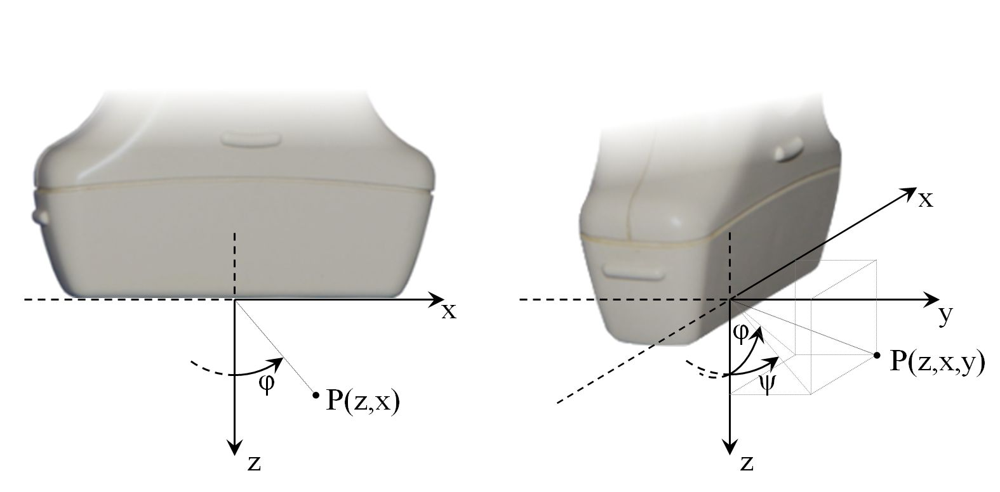

.. _arrus-api-main:

========================
Glossary and assumptions
========================

This document contains the basic definitions and assumptions that apply to the
rest of content available in this site.

Glossary
========

Session
-------

User communicates with the available devices in a single session. Session is an
abstract object that represents a connection between the client’s programming
interface and the devices. The session should be configured before taking any
further action. In particular, it is essential to provide a description of the
ultrasound system which the user wants to connect to.

During the session, the user can:

- get the handle to the available devices (and access e.g. device parameters)
- run operations/a graph of operations on the devices (currently available:
  running a specific  sequence operation on the us4R device)
- start/stop (freeze) the currently running graph (currently available:
  starting/stopping the us4R device)

Devices
-------

Device
``````

An abstract class that represents a component of the system. The device can be
steered by the user. The device can be programmable, which means that it is
possible to load and execute a sequence of operations on the device.
Each device and its components are identified by a pair:
(device type, ordinal number in the system), e.g. "Us4R:0", "GPU:0", "GPU:1", etc.
During a given session the device can be identified by an absolute path to the
given device. The absolute path is determined by the device declaration
provided in a session configuration file.

Probe
`````

An electronic device that transmits the ultrasound wave and records the
response. A probe model is identified by the manufacturer and probe model
id, e.g. (“esaote”, “sl1543”) (in future, probe serial number can added).

Devices: us4R and components
````````````````````````````

us4OEM
''''''

An electronic, programmable device responsible for steering the signal
transmitted to the ProbeAdapter. Currently, a single us4oem allows to transmit
data using 128 channels and acquire echo data using 32 channels in a single
Tx/Rx operation.

ProbeAdapter
''''''''''''

Probe interface adapter - a system component responsible for the communication
between a probe and the system us4OEM modules. The probe interface transfers
tx/rx signals between the probe and the selected us4oem modules.

us4R
''''

A complete us4R system. The us4R system consists of: us4OEM modules
(e.g. us4R-lite consists of 2 modules, us4R consists of 8 modules),
probe adapter, probe, high voltage supplier.

Devices: processing units
`````````````````````````

GPU
'''

Graphical Processing Unit. Currently Nvidia GPU are supported only.

CPU
'''

Central Processing Unit on which operations should be performed.

Ultrasound device operations
----------------------------

Scheme
``````

Scheme is a complete program that has to be loaded on the device.
Currently, it consists of tx/rx sequence and processing pipeline definitions.

Operation (Op)
``````````````
In ARRUS, the user defines operations to be executed on a particular device.
Each operation has its placement, e.g. TxRx operations can be performed on
ultrasound programmable devices (e.g. us4R) and RxBeamforming can be
performed on processing units (e.g. CPU or GPU).

TxRx
````

The ultrasound device implements the TxRx operation, that is, a single transmit
and echo signal reception. The result of this operation is stored directly in
the system’s DDR memory, and then transferred to the PC for further processing.
A single `TxRx` allows to transmit a signal impulse and receive echo data using
at most the number of channels specific for a selected device. A single TxRx
operation produces a single RF frame.

TxRxSequence
````````````

A sequence of TxRxs to execute on a device in a loop. A single TxRxSequence
produces a sequence of frames or a batch of sequences.

Data
----

RF frame
````````

A frame is an output of a single Tx/Rx operation. An example of a single
frame is a 2-D frame which can be beamformed to a single scanline for a
linear scanning scheme.

RF sequence
```````````

A sequence of frames (in short: sequence) is an output of a sequence of
Tx/Rx operations. An example of a sequence is a 3-D array with shape
(frame, sample, channel), from which a single b-mode image can be reconstructed.

RF batch
````````

A batch of sequences (in short: a batch) is a collection of multiple
RF sequences.

Adopted coordinate system
=========================

The adopted coordinate system is shown in :numref:`fig-coordinate_system_def`.

.. _fig-coordinate_system_def:


     Adopted coordinate system in the imaging plane (left) and taking into
     account the 3rd dimension (right).

Important notes:

* point coordinates are written in (z,x) or (z,x,y) format
* point (0,0,0) is at the center of the probe’s surface,
* the orientation of the coordinates' axes are shown in :numref:`fig-coordinate_system_def` ,
* angle :math:`\phi=0`  covers with the z-axis direction and positive
  :math:`\phi` direction is counter-clockwise.