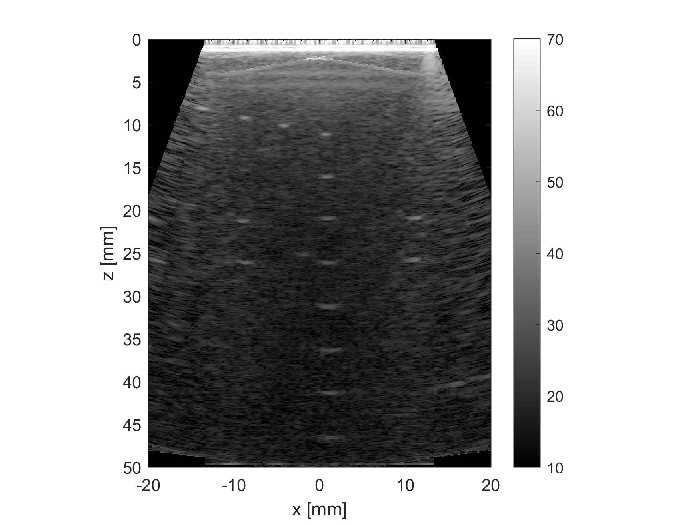
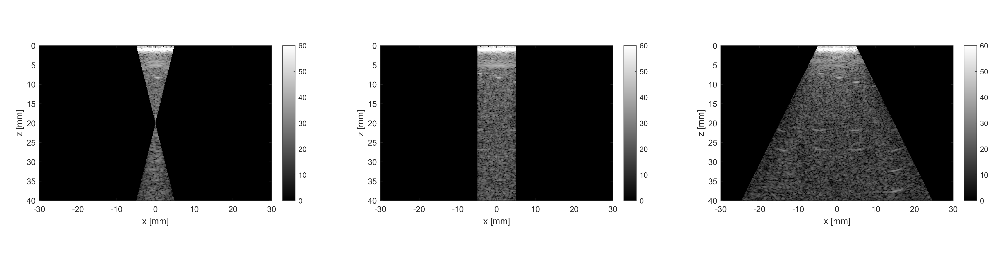
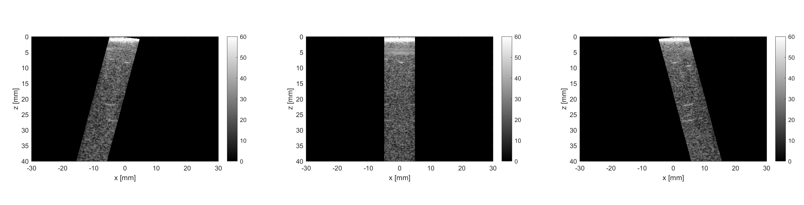
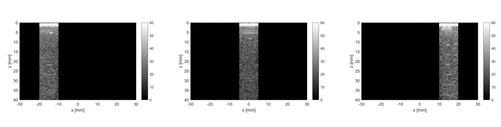
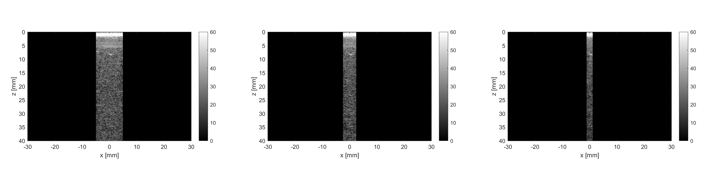
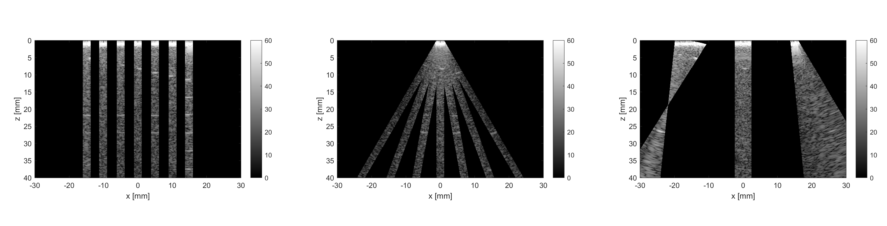
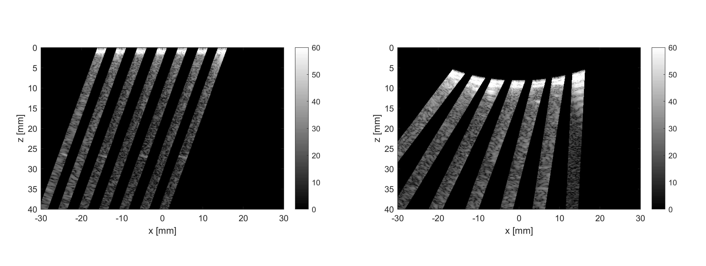
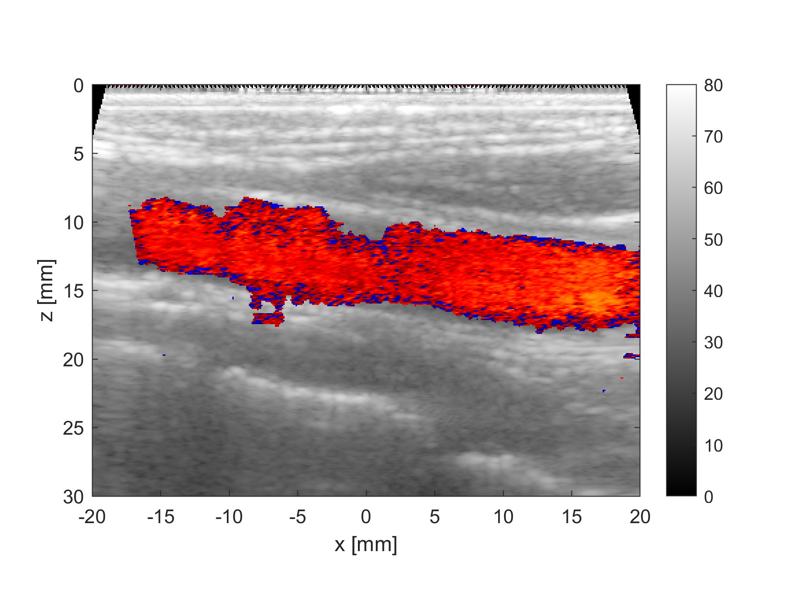

==============
Examples
==============

In the following parts of this chapter we will show you how to use 
the ARRUS software to communicate with the system in order to:

* program the transmission/reception (TX/RX) sequence and reconstruction,
* acquire raw RF data,
* acquire reconstructed B-mode data,
* obtain a real-time B-mode imaging.

The source code of the ready-to-run examples can be found in examples directory:

* Us4R_control_bmodePwi - for B-Mode imaging using Plane Waves,
* Us4R_control_bmodeDwi - for B-Mode imaging using Diverging Waves,
* Us4R_control_bmodeLin - for B-Mode imaging using classical Line-by-line imaging,
* Us4R_control_colorPwi - for B-Mode & Color Doppler imaging using Plane Waves.

For more information on the parameters of individual functions please refer
to section :ref:`arrus-api`.

Operations
==========

In ARRUS, you can define and run the **operations** available for the
supported hardware. Transmission/reception (TX/RX) sequences and B-mode image
reconstruction are examples of such operations.

TX/RX sequence
~~~~~~~~~~~~~~

To define a TX/RX sequence, you should create an instance of :ref:`arrus.CustomTxRxSequence` class. 
The name-value input argument pairs allow you to control various aspects of TX/RX.

.. code-block:: matlab

    seq = CustomTxRxSequence('txApertureCenter', 0e-3, ...
                             'txApertureSize',   128, ...
                             'rxApertureCenter', 0e-3, ...
                             'rxApertureSize',   128, ...
                             'txFocus',          inf, ...
                             'txAngle',          (-20:10:20)*pi/180, ...
                             'speedOfSound',     1540, ...
                             'txFrequency',      6.5e6, ...
                             'txNPeriods',       2, ...
                             'txVoltage',        20, ...
                             'rxDepthRange',     50e-3, ...
                             ... % Optional parameters
                             'hwDdcEnable',      true, ...
                             'decimation',       10, ...
                             'nRepetitions',     1, ...
                             'txPri',            400e-6, ...
                             'tgcStart',         14, ...
                             'tgcSlope',         200, ...
                             'txInvert',         false );

The above example shows how to create the CustomTxRxSequence object with a complete set of 
input parameters. First 11 parameters are obligatory, others are optional. 

Interchangeability of parameters
````````````````````````````````

For your convenience:

* txApertureCenter [m] can be replaced with txCenterElement [elem],
* rxApertureCenter [m] can be replaced with rxCenterElement [elem],
* rxDepthRange [m] can be replaced with rxNSamples [samp].

Scalar/vector parameters, sequence length
`````````````````````````````````````````

The following parameters can be scalars or vectors:

* txApertureCenter or txCenterElement,
* txApertureSize,
* rxApertureCenter or rxCenterElement,
* txFocus,
* txAngle,
* txFrequency,
* txNPeriods,
* txInvert.

If any of them is a vector, then its length determines the number of TXs in the sequence. 
All the other parameters must be scalars or vectors of the same length. If any parameter 
is defined as a scalar, then it is assumed to be constant over the whole sequence. 
If all parameters are scalars, then the sequence contains a single TX/RX.

All the remaining parameters must be scalars, i.e. they are constant for every TX/RX.

Typical TX/RX strategies
````````````````````````

To program the typical TX waves:

* focused wave: set txFocus to positive finite values [m],
* diverging wave: set txFocus to negative finite values [m],
* plane wave: set txFocus to inf (as in the code example above).

To program the typical scanning strategies:

* phased scanning: set txAngle to a vector of scanning angles [rad] (as in the code example above),
* scanning TX aperture: set txApertureCenter [m] or txCenterElement [elem] to a vector of TX aperture positions,
* scanning RX aperture: set rxApertureCenter [m] or rxCenterElement [elem] to a vector of RX aperture positions,

Raw data format
```````````````

The collected raw data format depends on the hwDdcEnable setting:

* set hwDdcEnable to **false** to acquire the original raw RF data, 
* set hwDdcEnable to **true** to reduce the data stream, the collected data is in complex IQ format.

For more information, see the documentation of available :ref:`arrus-api-sequences`.

Reconstruction
~~~~~~~~~~~~~~

To define how to perform B-mode image reconstruction, you should create an instance of :ref:`arrus.Reconstruction` 
class. The name-value input argument pairs allow you to control various aspects of reconstruction.

.. code-block:: matlab

    rec = Reconstruction('xGrid',            (-20:0.10:20)*1e-3, ...
                         'zGrid',            (  0:0.10:50)*1e-3, ...
                         ... % Optional parameters
                         'bmodeRxTangLim',   [-0.5 0.5], ...
                         'rxApod',           hamming(10) ...
                         );

The xGrid and zGrid inputs define the reconstruction grid and thus they are obligatory. Other inputs are optional 
and allow you to set the size of the dynamic RX aperture (bmodeRxTangLim) and the RX apodization function (rxApod). 
There are many more optional inputs for setting the raw data filtration, reconstruction mode, Color Doppler, etc. 

Running operations in the system
=================================

First, you should create a handle to the system on which you want to perform operations. For example, to communicate 
with the Us4R system, create an instance of the Us4R class. You will need to indicate a prototxt config file 
containing the information on the probe, adapter, gains, etc. It is **extremly important** to make sure that the 
**system configuration agrees with the content of the config file**.

.. code-block:: matlab

    us  = Us4R('configFile', 'us4r.prototxt');

To run the TX/RX sequence and the reconstruction (optionally), upload them onto the system:

.. code-block:: matlab

    us.upload(seq, rec);

If you only want to run the uploaded operation once (for example, to acquire a single RF frame), 
use the ``run`` function. It will return the RF data (or IQ data if the hwDdcEnable is set to true) 
and the reconstructed image data if the reconstruction was uploaded together with the TX/RX sequence.

.. code-block:: matlab

    [rf,img] = us.run;

If you want to run the uploaded operation in a loop e.g. for real-time imaging, use the ``runLoop`` function together 
with a display-dedicated object. We prepared two classes of display objects: :ref:`arrus.BModeDisplay` and 
:ref:`arrus.DuplexDisplay` (for simultaneous display of B-mode and Color Doppler).

.. code-block:: matlab

    display = BModeDisplay(rec, 'dynamicRange', [10 70]);
    us.runLoop(@display.isOpen, @display.updateImg);

.. code-block:: matlab

    display = DuplexDisplay(rec, 'dynamicRange',    [10 70], ...
                                 'powerThreshold',  20);
    us.runLoop(@display.isOpen, @display.updateImg);

Below is an example of image from a wire phantom obtained and displayed with use of the CustomTxRxSequence, 
Reconstruction, and BModeDisplay objects defined as above.



    Image of the ATS549 phantom (wires part) obtained with use of the Plane Wave Imaging.

See the :ref:`arrus-Us4R` docs for more information.

Tips
~~~~

If you have the object of class Us4R, then you can easily obtain the number of probe elements using getNProbeElem method:

.. code-block:: matlab

    us.getNProbeElem

Specific examples
=================

To present the typical TX/RX issues (except for Color Doppler example), we will use a very simple Reconstruction object 
with only the reconstruction grid defined (other parameters are assigned default values). 

.. code-block:: matlab

    rec = Reconstruction('xGrid', (-30:0.10:30)*1e-3, ...
                         'zGrid', (  0:0.10:40)*1e-3 );

As the reconstruction operates only on the image areas covered by the TX beams, the resulting images will give us 
insight into the shape, orientation, and position of the TX beams.

Beam formation
~~~~~~~~~~~~~~

The following parameters determine the beam shape, position and orientation:

* txFocus [m] - distance between the TX aperture center and the focal point,
* txAngle [rad] - angle between the TX beam and the normal to the probe surface at the TX aperture center,
* txApertureCenter [m] (or txCenterElement [elem]) - position of the TX aperture center along the probe surface,
* txApertureSize [elem] - size of the TX aperture.

Let the following to be our default set of sequence parameters:

.. code-block:: matlab

    seq = CustomTxRxSequence('txApertureCenter', 0e-3, ...
                             'txApertureSize',   48, ...
                             'rxApertureCenter', 0e-3, ...
                             'rxApertureSize',   us.getNProbeElem, ...
                             'txFocus',          inf, ...
                             'txAngle',          0*pi/180, ...
                             'speedOfSound',     1540, ...
                             'txFrequency',      5e6, ...
                             'txNPeriods',       2, ...
                             'txVoltage',        10, ...
                             'rxDepthRange',     50e-3, ...
                             'tgcStart',         14, ...
                             'tgcSlope',         200 );

Now, let us manipulate the parameters determining the TX beam. 
For various 'txFocus' values we can get focused wave (finite positive values), plane wave (infinity), or diverging wave (finite negative values):



    'txFocus' set to 20e-3 (left), inf (middle), and -10e-3 (right).

When changing the 'txAngle' the TX beam axis is angled clockwise (negative values) or counter-clockwise (positive values):



    'txAngle' set to -15*pi/180 (left), 0*pi/180 (middle), and 15*pi/180 (right).

Changing the 'txApertureCenter' and 'txCenterElement' move the aperture center along the probe surface.



    'txApertureCenter' set to -15e-3 (left), 0e-3 (middle), and 15e-3 (right).

The 'txApertureSize' determines how many elements are included in the TX aperture. 



    'txApertureSize' set to 48 (left), 24 (middle), and 12 (right).

In case of a combination of aperture position and size resulting in TX aperture extending beyond the probe, the TX aperture is clipped.

Compounding/scanning strategies
~~~~~~~~~~~~~~~~~~~

The above examples contained single TXs. It is however typical to use multiple emissions to image wider area (scanning), improve image quality (compounding), etc.
The basic scanning strategies will be presented using TX/RX sequences of plane waves emitted from a narrow TX aperture with coarse scanning step, to clearly visualize the process.

Linear scanning
```````````````

In the linear scanning the TX aperture moves along the probe surface. Usually, the RX aperture does the same. Other parameters are constant: 

.. code-block:: matlab

    seq = CustomTxRxSequence(   'txApertureCenter', [-20:10:20]*1e-3, ...
                                'txApertureSize',   32, ...
                                'rxApertureCenter', [-20:10:20]*1e-3, ...
                                'rxApertureSize',   64, ...
                                'txFocus',          inf, ...
                                'txAngle',          0*pi/180, ...
                                % some other parameters 
                                );

or

.. code-block:: matlab

    seq = CustomTxRxSequence(   'txCenterElement',  1:32:us.getNProbeElem, ...
                                'txApertureSize',   32, ...
                                'rxCenterElement',  1:32:us.getNProbeElem, ...
                                'rxApertureSize',   64, ...
                                'txFocus',          inf, ...
                                'txAngle',          0*pi/180, ...
                                % some other parameters 
                                );

Phased (angular) scanning
`````````````````````````

In the phased scanning the aperture position is constant, but the TX angle varies.

.. code-block:: matlab

    seq = CustomTxRxSequence(   'txApertureCenter', 0e-3, ...
                                'txApertureSize',   32, ...
                                'rxApertureCenter', 0e-3, ...
                                'rxApertureSize',   64, ...
                                'txFocus',          inf, ...
                                'txAngle',          [-30:15:30]*pi/180, ...
                                % some other parameters 
                                );

Custom sequence
```````````````

Typical imaging schemes use consistent types of waves (e.g. plane wave only) and scanning approaches (e.g. angular scanning only).
However, nothing stops us from designing a TX sequence in which all the discussed parameters are varying.

.. code-block:: matlab

    seq = CustomTxRxSequence(   'txApertureCenter', [-20 0 20]*1e-3, ...
                                'txApertureSize',   [32 16 8], ...
                                'txFocus',          [30 inf -5]*1e-3, ...
                                'txAngle',          [-10 0 10]*pi/180, ...
                                % some other parameters 
                                );



    Example of linear scan (left), angular/phased scan (middle), and custom scan (right).

Probe geometry
~~~~~~~~~~~~~~

What seems clear for linear array, may become not that obvious in the case of convex probe (or any other curved array). 
To program the TX/RX sequence for a convex probe correctly, one has to remember that:

* TX/RX aperture positions are measured **along the probe surface**, not necessarily along the x-axis (horizontal axis),
* TX angles are measured **relative to the normal to the head surface at the center of the TX aperture**,
* TX focuses are measured **relative to the center of the TX aperture**,
* the z-coordinate is adjusted so that z=0 refers to the most withdrawn elements of the probe, which in case of the convex probes are their side elements.

For example, if we set the TX as follows:

.. code-block:: matlab

    seq = CustomTxRxSequence(   'txApertureCenter', -20e-3, ...
                                'txApertureSize',   8, ...
                                'txFocus',          inf, ...
                                'txAngle',          0*pi/180, ...
                                % some other parameters 
                                );

then we obtain the following behaviour depending on the geometry of the probe:



    Example of the probe geometry influence on the programmed TX beams: linear probe (left) and convex probe (right).

Color Doppler
~~~~~~~~~~~~~

To enable the Color Doppler mode, one has to:

* create the TX/RX Sequence that will **collect the echoes the same way a number of times**,
* create the Reconstruction that will enable and define the Doppler processing.

Below is an example of a sequence that will acquire the data for both: B-mode and Color Doppler. In both modes 
the sequence utilizes plane waves ('txFocus' set to inf) emitted from the whole probe, and the echoes are recorded 
with all the probe elements as well (TX/RX aperture centered at the probe center x=0, aperture size equal to number of probe elements). 

* In case of B-mode the plane waves will be emitted at 7 different angles for compounding purposes: (-15:5:15)*pi/180. 
* In case of Color Doppler there will be 32 plane waves, all emitted at 15*pi/180 angle.

.. code-block:: matlab

    seq = CustomTxRxSequence(   'txApertureCenter', 0e-3, ...
                                'txApertureSize',   us.getNProbeElem, ...
                                'rxApertureCenter', 0e-3, ...
                                'rxApertureSize',   us.getNProbeElem, ...
                                'txFocus',          inf, ...
                                'txAngle',          [-15:5:15, 15*ones(1,32)]*pi/180, ...
                                % some other parameters 
                                );

The Reconstruction parameters, apart from the reconstruction grid, must contain:

* Color Doppler enable flag ('colorEnable' set to true),
* frame identifiers: frames 1-7 are utilized by B-mode ('bmodeFrames' set to 1:7), the following 32 frames are used for 
Color Doppler ('colorFrames' set to 7+(1:32)),
* limits of RX tangents for Color Doppler reconstruction ('colorRxTangLim'). The default is [-0.5 0.5]. It is reasonable 
to add an offset to make the RX beam angled the same way as the TX beam.
* coefficients of a high-pass Wall Clutter Filter ('wcFilterBCoeff' and 'wcFilterACoeff'). Optionally there is a possibility 
to omit first n output samples of the filter ('wcFiltInitSize') to reduce the influence of its transient characteristics.

.. code-block:: matlab
    
    [wcfB, wcfA] = butter(4,0.2,'high');
    
    rec = Reconstruction(   'xGrid',            (-20:0.10:20)*1e-3, ...
                            'zGrid',            (  0:0.10:30)*1e-3, ...
                            'bmodeFrames',      1:7, ...
                            'colorEnable',      true, ...
                            'colorFrames',      7 + (1:32), ...
                            'colorRxTangLim',	tan(15*pi/180) + [-0.5 0.5], ...
                            'wcFilterBCoeff',   wcfB, ...
                            'wcFilterACoeff',	wcfA, ...
                            'wcFiltInitSize',	8);



    Color Doppler image of the carotid artery

Tips
~~~~

To obtain good Doppler signal it is suggested to use longer TX pulses ('txNPeriods' equal 4 or more).

The Color Doppler scale corresponds to a range from -pi to pi [rad per sample]. To convert it to the Doppler frequencies, 
one has to know the Pulse Repetition Frequency (PRF) which is given by the formula: PRF = 1/txPri/nFirePerTx. 'txPri' is 
the time between physical emissions and is one of the pareameters of the CustomTxRxSequence. nFirePerTx is the number of 
repeting the emissions needed to acquire the echoes with the programmed RX aperture (e.g. 'rxApertureSize' is 192, number 
of system RX channels is 64, then each TX must be repeated 3 times so that the 64-channel system can acquire 192-channel data).
