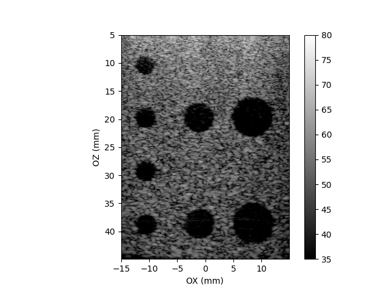

========
Examples
========

In the following parts of this chapter, we will show you how to run example
scripts available in the ARRUS software. The source code of the ready-to-run
examples can be found in |api_language|/examples directory.

For more information on the parameters of individual functions please refer
to section :ref:`arrus-api`.

For the user guide and all the assumptions (e.g. about the coordinate system)
please visit sections :ref:`arrus-definitions` and :ref:`arrus-user-guide`.

Before running any of the below examples:

- Make sure you are running the Python script using the appropriate Python distribution;
  please install |api_language|/examples/requirements.txt file first (if you haven't already that done).
- Make sure you are using correct configuration file. See :ref:`arrus-running-scheme` for more information how the path to configuration file is determined when creating session object.
- Make sure that the correct parameters are set, in particular the transmitting voltage.

Plane Wave Imaging
==================

#. Go to |api_language|/examples directory.
#. Run ``python plane_wave_imaging.py``

After starting the script, you should be able to see an output similar to the below one:

    Plane wave imaging python script output. Phantom: ATS549, cysts.

.. Diverging Beams

.. Classical Beamforming

.. Custom TX/RX Sequence

.. Custom Callback

