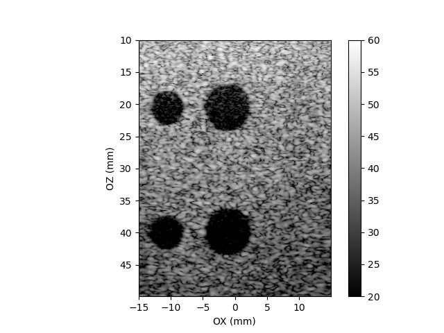

========
Examples
========

In the following parts of this chapter, we will show you how to run example
scripts available in the ARRUS software. The source code of the ready-to-run
examples can be found in |api_language|/examples directory.

For more information on the parameters of individual functions please refer
to section :ref:`arrus-api`.

For the user guide and all the assumptions (e.g. about the coordinate system)
please visit sections :ref:`arrus-definitions` and :ref:`arrus-user-guide`.

Before running any of the below examples:

- Make sure you are running the Python script using the appropriate Python distribution;
  please install |api_language|/examples/requirements.txt file first (if you haven't already that done).
- Make sure you are using correct configuration file. See :ref:`arrus-running-scheme` for more information how the path to configuration file is determined when creating session object.
- Make sure that the correct parameters are set, in particular the transmitting voltage.

Plane Wave Imaging
==================

#. Go to |api_language|/examples directory.
#. Run ``python plane_wave_imaging.py``

This scrip implement 'plane wave imaging' scheme, 
where the image is formed by combining a couple low-resolution images into one high-resolution image.
Each low-resolution image is formed using data acquired after transmission of a plane wave at a different angle.
After starting the script, you should be able to see an output similar to the below one:

    Plane wave imaging python script output. Phantom: ATS549, cysts. Probe: L14-5/38 from Ultrasonix.

Classical Beamforming
=====================

#. Go to |api_language|/examples directory.
#. Run ``python classical_beamforming.py``

This script implement classical transmit-receive scheme, 
where the image is formed using line by line scanning.
After starting the script, you should be able to see an output image similar to the below one:

    Classical beamforming script output image. Phantom: ATS549, cysts. Probe: L14-5/38 from Ultrasonix. 

Diverging Beams
===============

#. Go to |api_language|/examples directory.
#. Run ``python diverging_beams.py``

This script implement diverging beams transmit-receive scheme, 
where the image is formed using data acquired after couple transmissions of diverging beams 
with different virtual focuses. 
After starting the script, you should be able to see an output image similar to the below one:

.. figure:: img/bmode_div_phantom_cysts.png

    Diverging beams scheme script output image. Phantom: ATS549, cysts. Probe: L14-5/38 from Ultrasonix. 

Others
======

The /examples directory contain addtional scripts ``custom_callback.py`` and ``custom_tx_rx_sequence.py``
which show how to construct custom sequences and callbacks. 

.. Custom TX/RX Sequence

.. Custom Callback

