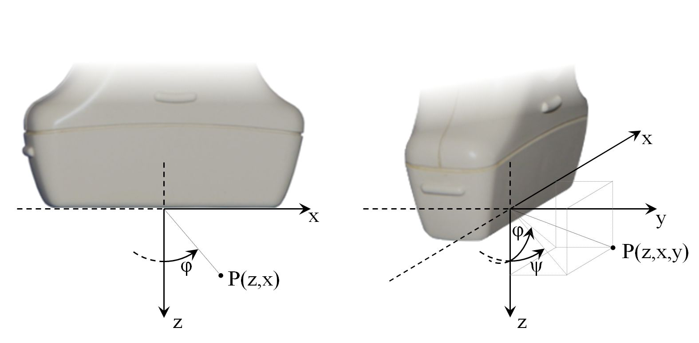

==============
B-mode Imaging
==============

In the following parts of this chapter we show how you can communicate with
the system in order to acquire RF data for B-mode image reconstruction using
ARRUS software. The source code of the ready to run examples is in
|api_language|/examples directory.

For more information on the parameters of individual functions please refer
to the section :ref:`arrus-api-main`.

Coordinate system
=================

The adopted coordinate system is shown in :numref:`fig-coordinate_system`.

.. _fig-coordinate_system:

     Adopted coordinate system in the imaging plane (left) and taking into
     account 3rd dimension (right).

Important notes:

* point coordinates are written in (z,x) or (z,x,y) format
* point (0,0,0) is at the center of the probe’s surface,
* orientation of coordinates axes are shown in :numref:`fig-coordinate_system` ,
* angle :math:`\phi=0`  covers with the z-axis direction and positive
  :math:`\phi` direction is counter-clockwise.

Operations
==========

In ARRUS users can define and run **operations**  available for the
supported hardware. Transmission/reception (TX/RX) sequences and B-mode image
reconstruction are examples of such operations.

TX/RX sequence
~~~~~~~~~~~~~~

The following sequences are currently available:

* Synthetic Transmit Aperture (STA),
* Plane Wave Imaging (PWI),
* classical beamforming (LIN).

To define an operation, user should create an instance of an appropriate
class.

For example, to create a TX/RX sequence for Synthetic Transmit Aperture Imaging:

.. code-block:: matlab

    seqSTA = STASequence('txApertureCenter', (-15:3:15)*1e-3, ...
                         'txApertureSize',   32, ...
                         'txFocus',          -6*1e-3, ...
                         'txAngle',          0*pi/180, ...
                         'speedOfSound',     1450, ...
                         'txFrequency',      txFrequency, ...
                         'txNPeriods',       2, ...
                         'rxNSamples',       8*1024, ...
                         'txPri',            200, ...
                         'tgcStart',         14, ...
                         'tgcSlope',         2e2);

To create a TX/RX sequence for Plane Wave Imaging:

.. code-block:: matlab

    seqPWI = PWISequence('txApertureCenter', 0*1e-3, ...
                         'txApertureSize',   192, ...
                         'txAngle',          [-10 0 10]*pi/180, ...
                         'speedOfSound',     1450, ...
                         'txFrequency',      txFrequency, ...
                         'txNPeriods',       2, ...
                         'rxNSamples',       8*1024, ...
                         'txPri',            200, ...
                         'tgcStart',         14, ...
                         'tgcSlope',         2e2);

To create a TX/RX sequence for classical beamforming:

.. code-block:: matlab

    seqLIN = LINSequence('txCenterElement', 1:128, ...
                         'txApertureSize',  32, ...
                         'txFocus',         20*1e-3, ...
                         'txAngle',         0*pi/180, ...
                         'speedOfSound',    1450, ...
                         'txFrequency',     txFrequency, ...
                         'txNPeriods',      2, ...
                         'rxNSamples',      8*1024, ...
                         'txPri',           200*1e-6, ...
                         'tgcStart',        14, ...
                         'tgcSlope',        2e2);

For more information check the documentation of available :ref:`arrus-api-sequences`.

Reconstruction
~~~~~~~~~~~~~~

To perform B-mode image reconstruction, create an instance of
:ref:`arrus.Reconstruction` class.

.. code-block:: matlab

    rec = Reconstruction('filterEnable',     true, ...
                         'filterACoeff',     filtA, ...
                         'filterBCoeff',     filtB, ...
                         'iqEnable',         true, ...
                         'cicOrder',         2, ...
                         'decimation',       4, ...
                         'xGrid',            (-20:0.10:20)*1e-3, ...
                         'zGrid',            (  0:0.10:50)*1e-3);

Running operations in the system
=================================

First, you should create a handle to the system on which you want to perform
operations. For example, to communicate with Us4R system, create an instance of
Us4R class.

.. code-block:: matlab

    % Create a handle to Us4R system with two modules and set voltage to 50
    us	= Us4R(2, 'AL2442', 50);

Before running a specific operation, upload it on the system:

.. code-block:: matlab

    us.upload(seqPWI);

If you want to run the uploaded operation only once (for example, to acquire
single RF frame), use the ``run`` function.

.. code-block:: matlab

    [rf,img] = us.run;

If you want to run the uploaded operation in a loop (for example, to display
B-mode image interactively), use the ``runLoop`` function.

.. code-block:: matlab

    displayWindow = BModeDisplay((-20:0.10:20)*1e-3, (  0:0.10:50)*1e-3);
    us.runLoop(@displayWindow.isOpen, @displayWindow.updateImg);

Check the :ref:`arrus-Us4R` docs for more information.
