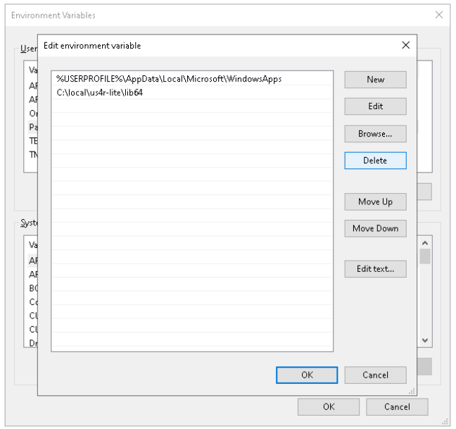
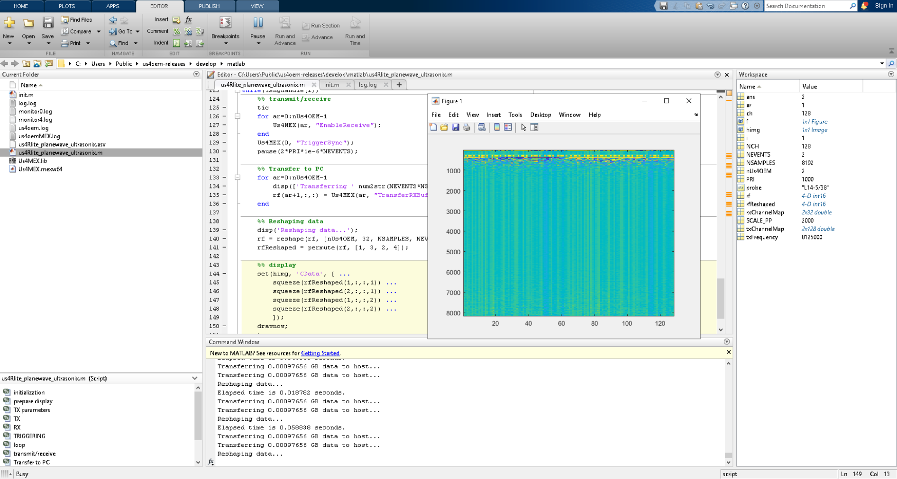

========================
Installation and startup
========================

Requirements
============

Microsoft® Windows 10 x64 operating system is supported.

Make sure that you have installed following dependencies:

- `Microsoft Visual C++ Redistributable for Visual Studio 2017 <https://aka.ms/vs/16/release/vc_redist.x64.exe>`_

Installation
============

Drivers
-------

Make sure, that your us4R-lite device is properly connected via Thunderbolt-3
cable and is enabled in your Thunderbolt software, e.g.:

.. figure:: img/thunderbolt.png
    :scale: 80%

The `Connection status` should be `Connected` (or something similar).

Then perform the following driver installation procedure:

1. Download and extract `arius-drivers-1290.zip <https://github.com/us4useu/arrus-public/releases/download/arius-drivers-1290/arius-drivers-1290.zip>`_ file, for example into ``C:\local\arius-drivers-1290\`` directory.
2. Disable driver signature enforcement on Windows 10:

    1. Click “start menu → Settings → Update and Security → Recovery →
       Restart now” under Advanced startup
    2. Press “Troubleshoot → Advanced options → Startup settings →
       Restart”
    3. After the computer restart a list of options should be presented.
       Press F7 to choose “Disable driver signature enforcement”.

3. Run ``C:\local\arius-drivers-1290\install.bat`` with **administrative
   privileges**. Confirm driver installation if necessary.
4. If your hardware is properly connected to the computer, a new ``PCI device``
   node should be visible in Windows Device Manager. Install drivers for the ``PCI Device``
   using ``C:\local\arius-drivers-1290\drivers\arius.inf`` file.

As a result, two ``ARIUS`` nodes should be visible in the Device Manager.

.. figure:: img/dev_manager.png
    :scale: 100%

MATLAB API
----------

1. Download and extract: `us4R-lite.zip <https://github.com/us4useu/arrus-public/releases/download/us4r-legacy/us4R-lite.zip>`_
2. Add ``lib64`` directory to your system' Path environment variable.

Startup
=======

.. caution::

    If you use **MSI GS65 laptop**, follow this extended startup procedure:

    1. Turn off the notebook and the us4R-lite device, plug off Thunderbolt-3 cable.
    2. Turn on the us4R-lite, then connect it to the notebook using the provided Thunderbolt-3 cable.
    3. Turn on the notebook.
    4. After Windows 10 loads, restart the notebook.

Firmware update
---------------

Before running example scripts you need to perform firmware update:

1. Open command prompt or power shell.
2. Change current directory to the ``bin`` folder of the extracted
   ``us4R-lite.zip`` file.
3. Run ``update.bat`` script.

You should see the progress bar of the firmware update process. The whole
operation takes several minutes. After the update finishes shutdown the system
and PC and power on again.

Running example script
----------------------

MATLAB 2018b is required.

You can find all MATLAB related files in ``matlab`` subdirectory:

- ``matlab\Us4MEX.mexw64`` is a MEX file, which provides interface to communicate with a hardware; add this file to your MATLAB paths,
- ``matlab\us4Rlite_planewave_ultrasonix.m`` contains an example script to run.

Just to check if everything is ok run script ``matlab\us4Rlite_planewave_ultrasonix.m``.
You should expect the following window with raw RF data:

