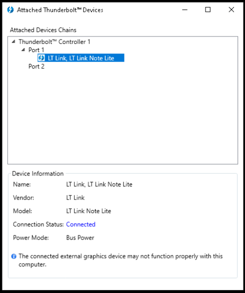
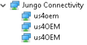
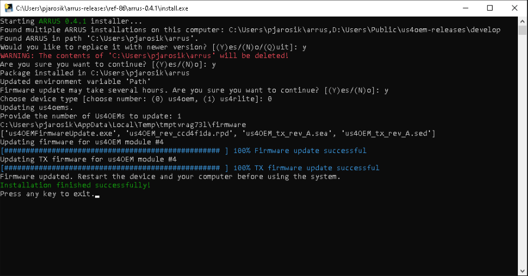

.. _arrus-installation:

============
Installation
============

Requirements
============

The Microsoft® Windows 10 x64 operating system is supported.

Make sure that you have installed the following dependencies:

- `Microsoft Visual C++ Redistributable for Visual Studio 2017 <https://aka.ms/vs/16/release/vc_redist.x64.exe>`_

Installation
============

Startup
-------

.. caution::

    If you use the **MSI GS65 notebook** and connect with the device via a Thunderbolt-3
    cable, you have to follow this extended startup procedure:

    1. Turn off the notebook and your device, plug off Thunderbolt-3 cable.
    2. Turn on the system, then connect it to the notebook using the provided
       Thunderbolt-3 cable.
    3. Turn on the notebook.
    4. After Windows 10 loads, restart the notebook.

Drivers
-------

Make sure that your us4R-lite device is properly connected via a Thunderbolt-3
cable and is enabled in your Thunderbolt software, e.g.:

The `Connection status` should read `Connected` (or something similar).

Uninstall ARIUS drivers (if previously installed)
~~~~~~~~~~~~~~~~~~~~~~~~~~~~~~~~~~~~~~~~~~~~~~~~~
If ARIUS drivers are installed on your computer, uninstall them first. ARIUS
drivers are the legacy drivers that were required before the 0.4.3 version.

1. Open the Windows Device Manager, uninstall all ``ARIUS`` and ``WinDriver1290``
   devices available in the "Jungo Connectivity" node. **Check
   "Delete the driver software for this device"**.

.. figure:: img/uninstall_arius_drv.png
    :scale: 100%

2. Restart computer.

Install Us4OEM drivers
~~~~~~~~~~~~~~~~~~~~~~

1. Download and extract ``us4oem-drivers-1290.zip`` (contact us4us support to make sure you get the newest version).
2. Run ``install.bat`` with **administrative privileges**. Confirm driver
   installation if necessary.

``us4oem`` and ``us4OEM`` nodes should now be visible in the
Device Manager.

ARRUS
-----

Before you proceed, please make sure the device is properly connected to the computer.

1. Download and extract the |arrus|_ package.
2. Run the ``install.exe`` file and follow the instructions provided.

.. _fig-install_result:

.. include:: api.rst

