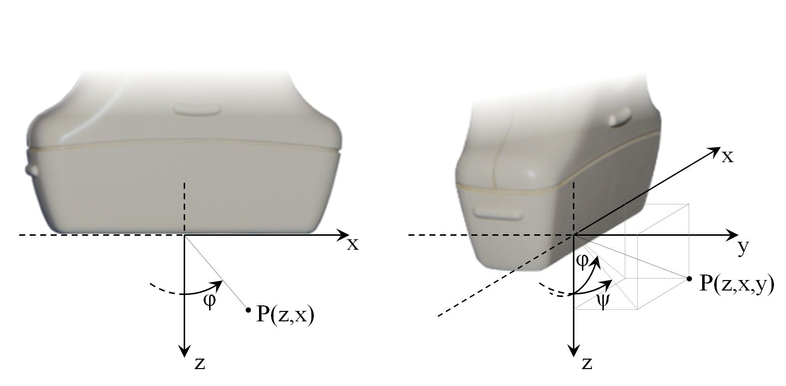

Introduction
============

Coordinate system
-----------------

The adopted coordinate system is shown in :numref:`fig-coordinate_system`.

.. _fig-coordinate_system:

     Adopted coordinate system in the imaging plane (left) and taking into
     account 3rd dimension (right).

Important notes:

* point coordinates are written in (z,x) or (z,x,y) format

    * exception: Field II with (x,y,z) format,

* point (0,0,0) is at the center of the probe’s surface,
* orientation of coordinates axes are shown in Fig. 1.,
* angle :math:`\phi=0`  covers with the z-axis direction and positive
  :math:`\phi` direction is counter-clockwise.

TX/RX schemes
-------------

There are four basic transmission/reception (TX/RX) schemes included in the
scripts:

* Synthetic Transmit Aperture (STA),
* Plane Wave Imaging (PWI),
* PHAsed array (PHA),
* LINear array (LIN).

They differ in terms of TX/RX apertures, TX delays, and reconstruction
approaches.

TX/RX apertures
~~~~~~~~~~~~~~~

The TX/RX apertures for each scheme are shown in :numref:`fig-apertures`.

.. _fig-apertures:

    TX/RX apertures for LIN (left), STA/MSTA (middle), and PWI/PHA (right).

Important notes:

* MSTA (Multi-element STA) uses more than a single element as the TX aperture
  (as in LIN),
* LIN (and also MSTA): the TX aperture is clipped for the starting
  and ending TX’s. If number of elements in TX aperture is:

    * odd, then its center element moves as in STA scheme,
    * even, then there is no center element, TX aperture starts as its half+1
      element and ends as its half.

TX/RX delays
~~~~~~~~~~~~

The TX delays are designed to provide a certain type of ultrasound beam:

* STA: defocused beam (TX delays=0),
* MSTA: defocused beam as if it origins from a virtual point of z<0,
* PWI: plane wavefront beam tilted at a given TX angle,
* PHA: focused beam tilted at a given TX angle,
* LIN: focused beam.

.. _fig-delays:

    TX parameters (focus, angle) and associated TX delay curves for LIN
    (focused beam), MSTA (defocused beam, diverging wave), and PWI
    (unfocused beam, plane wave).

Reconstruction approach
~~~~~~~~~~~~~~~~~~~~~~~

The common part of the reconstruction algorithms for each scheme is the use of
the Delay-And-Sum (DAS) procedure. For each reconstructed pixel:

* calculate round-trip time:

    * initial time delay (sum of a number of pixel-independent delays):

        * TX/RX switching delay,
        * burst factor (half the pulse length),
        * TX focusing delays,
        * filtration/DDC delay,

    * TX time (propagation time between time t0 and reflection at the considered
      location)
    * RX time (propagation time between reflection at the considered location
      and reception time).

* pick samples indicated by calculated time delays, for each pixel sum up
  samples picked up for various RX elements.

What differs the TX/RX schemes is the:

* reconstruction area for a single TX:

    * STA/MSTA/PWI: area covered by the pulse,
    * PHA/LIN: single imaging line,

* calculation of TX distances:

    * STA: distance from the transmitting element to the given pixel location,
    * MSTA: distance from the virtual source to the given pixel location minus
      the virtual focal length,
    * PWI: distance from the virtual (not emitted yet) plane wave front at
      time=t0 and the given pixel location,
    * PHA/LIN: distance from the center of the TX aperture to a given pixel
      location

See also tables: :numref:`tbl-sta_pwi` and :numref:`tbl-lin_pha`.

.. _tbl-sta_pwi:
.. table:: STA and PWI
    :widths: 50 25 25

    +----------------------+--------------------+------------------+
    |                      | **STA**            | **PWI**          |
    +======================+====================+==================+
    | **TX aperture size   | single element     | whole transducer |
    | [elements]**         |                    |                  |
    +----------------------+--------------------+------------------+
    | **RX aperture size   | whole transducer   | whole transducer |
    | [elements]**         |                    |                  |
    +----------------------+--------------------+------------------+
    | **TX scanning type** | moving TX aperture | tilting TX beam  |
    +----------------------+--------------------+------------------+
    | **TX focusing**      | defocused beam,    | unfocused beam,  |
    |                      |                    |                  |
    |                      | diverging wave     | plane wave       |
    |                      |                    |                  |
    |                      | (no TX delays)     |                  |
    +----------------------+--------------------+------------------+
    | **reconstruction area| whole image        | whole image      |
    | for a single TX**    |                    |                  |
    |                      | (sonified area)    | (sonified area)  |
    +----------------------+--------------------+------------------+

.. _tbl-lin_pha:
.. table:: LIN and PHA
    :widths: 50 25 25

    +----------------------+--------------------+-------------------+
    |                      | **LIN**            | **PHA**           |
    +======================+====================+===================+
    | **TX aperture size   | group of elements  | whole transducer  |
    | [elements]**         |                    |                   |
    +----------------------+--------------------+-------------------+
    | **RX aperture size   | group of elements  | whole transducer  |
    | [elements]**         |                    |                   |
    +----------------------+--------------------+-------------------+
    | **TX scanning type** | moving TX aperture | whole transducer  |
    +----------------------+--------------------+-------------------+
    | **TX focusing**      | focused beam       | focused beam      |
    +----------------------+--------------------+-------------------+
    | **reconstruction area| single image line  | single image line |
    | for a single TX**    |                    |                   |
    +----------------------+--------------------+-------------------+

