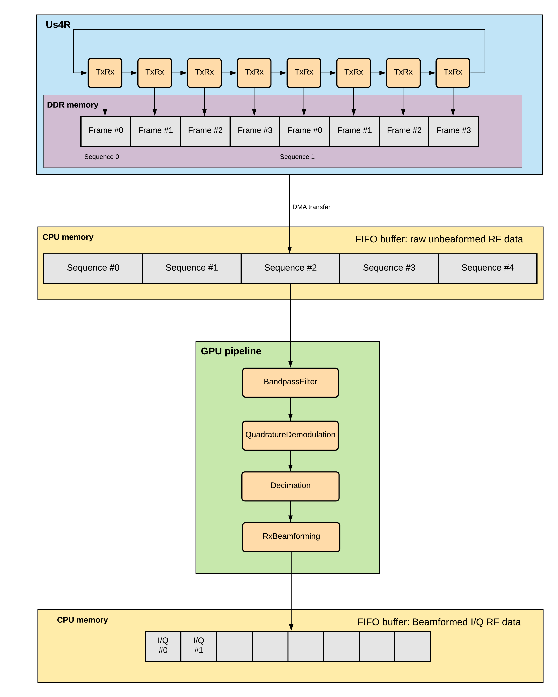

==========
User Guide
==========

This section describes how users can acquire data using ultrasound hardware.
Users can communicate with the device via a communication `session` object.
During the session it is possible to upload and run `operations`.

Configuring session
===================

.. note::

    The below sections contains details on how to configure the
    provided hardware. You can skip to :ref:`running_example`
    if you already have a session configuration file prepared by e.g.
    us4us developers, and you don't need to change any device-related
    parameters.


Session configuration file
--------------------------

A session configuration file consists of device settings valid for a given
session.
Currently, the configuration file can be written in .prototxt file
(a protobuf i/o format readable for humans).
Sample configuration files are available `here <https://github.com/us4useu/arrus/tree/develop/arrus/core/io/test-data>`_.

Currently only us4R device can be configured using session configuration file.

us4R
````

To use the us4R system in a particular session, create a field ``us4r`` in the
session configuration file.

::

    us4r: {
      # here goes us4r configuration spec.
      hv: {
        # ...
      }
      probe: {
        # ...
      }
      adapter: {
        # ...
      }
    }

The us4R device typically includes a high voltage supplier,
which can be configured by providing the ``hv`` field. For now, the us4R device
in the arrus package supports only one type of HV device:

::

    hv: {
      model_id {
        manufacturer: "us4us"
        name: "hv256"
      }
    }

To turn off the high voltage supplier, skip the ``hv`` field.

To configure us4r’s signal transmission/data reception, it is essential to
specify settings in exactly one of the following ways:

- specify the settings of the probe and probe adapter used in the system, or
- specify the settings of the particular us4OEM.

Specify the settings of the probe and probe adapter
'''''''''''''''''''''''''''''''''''''''''''''''''''

Examples:

- `use predefined probe and adapter <https://github.com/us4useu/arrus/blob/develop/arrus/core/io/test-data/us4r.prototxt>`_
- `create custom probe and adapter <https://github.com/us4useu/arrus/blob/develop/arrus/core/io/test-data/custom_us4r.prototxt>`_

Probe Model
...........

The user can specify which probe model they are currently using in one of the
following ways:

1. describe probe model by the providing ``probe`` field, e.g.:

::

    probe: {
      id: {
        manufacturer: "acme"
        name: "my_custom_probe"
      }
      n_elements: 64,
      curvature_radius: 50e-3,
      pitch: 0.21e-3,
      tx_frequency_range: {
        begin: 1e6,
        end: 40e6
      },
      voltage_range: {
        begin: 0,
        end: 100
      }
    }

The following ``probe`` attributes can be specified:

- ``id``: a unique probe model id — a pair: ``(manufacturer, name)``,
- ``n_elements``: number of probe elements,
- ``pitch``: distance between two adjacent probe elements [m],
- ``curvature_radius``: radius of probe’s curvature; when omitted and n_elements is a scalar, a linear probe type is assumed [m],
- ``tx_frequency_range``: acceptable range of center frequencies for this probe [min, max] (a closed interval) [Hz],
- ``voltage_range``: range of acceptable voltage values, 0.5*Vpp.


2. specify probe model by providing ``probe_id``:

::

    probe_id: {
      manufacturer: "esaote",
      name: "sl1543"
    }

If the latter method is used, the probe model description will be searched
in the dictionary file.

When no dictionary file is provided, the
:ref:`default-dictionary` will be assumed.


Probe-to-adapter connection
...........................

The ``probe_to_adapter_connection`` field specifies how the ``probe`` elements
map to the ``adapter`` channels.

There are several ways to specify this mapping:

- ``channel_mapping`` - a list of adapter channels to which the subsequent probe channels should be assigned, i.e. ``channel_mapping[i]`` is the adapter’s channel to be assigned to probe channel ``i``
- ``channel_mapping_ranges`` - a list of adapter channel regions to which the subsequent probe channels should be assigned.

See `here <https://github.com/us4useu/arrus/blob/develop/arrus/core/io/test-data/custom_us4r.prototxt>`_
for an example usage of ``probe_to_adapter_connection`` field.

Note:
This field is required only when a custom probe and adapter are specified in
the session configuration file (i.e. ``probe`` and ``adapter`` fields).
When the ``probe_id`` or ``adapter_id`` are provided and the connection between
them is already defined, this field can be omitted — the arrus package will
try to determine the probe-adapter mapping based on the dictionary file.
When ``probe_to_adapter_connection`` is still given, it will overwrite
the settings from the dictionary file.

Rx Settings
...........

The user can specify the default data reception settings to be set on all
system modules. To do this, add an `rx_settings` with the following attributes:

- ``dtgc_attenuation``: digital time gain compensation to apply (given as attenuation value to apply). Available values: 0, 6, 12, 18, 24, 30, 36, 42 [dB]. Optional, no value means turn off DTGC.
- ``pga_gain``: a gain to apply on a programmable gain amplifier. Available values: 24, 30 [dB]
- ``lna_gain``: a gain to apply on a low-noise amplifier. Available values:  12, 18, 24 [dB]
- ``tgc_samples``: a list of tgc curve samples to apply [dB]. Optional, no value/empty list means turn off TGC
- ``lpf_cutoff``: low-pass filter cut-off frequency, available values: 10000000, 15000000, 20000000, 30000000, 35000000, 50000000 [Hz]
- ``active_termination`` active termination to apply, available values: 50, 100, 200, 400. Optional, no value means turn off active termination.

Channel masks
.............

To turn off specific channels of the us4R system (i.e. the probe elements),
add both of the following fields to the `us4r` settings:

- ``channels_mask``: a list of system channels that should always be disabled
- ``us4oem_channels_mask``: a list of channel masks to apply on each us4OEM module

In order to minimize the risk of including channels that should be turned off,
for example by changing adapter model by mistake
(e.g. using esaote2 adapter mapping when actually esaote3 is installed),
it is necessary to specify the fields:
`channels_mask` and ``us4oem_channels_mask``. If these two mappings do not
match, an error will be reported at the device configuration stage.

Specify the us4OEM modules settings
'''''''''''''''''''''''''''''''''''

Example: https://github.com/us4useu/arrus/blob/develop/arrus/core/io/test-data/us4oems.prototxt

You can specify the configuration of each us4OEM module separately. To do this,
provide a list of ``us4oems`` in the ``us4r`` configuration file:

::

    us4r: {
      us4oems: [
        {
          # Us4OEM:0 settings
          channel_mapping: [...],
          active_channel_groups: [...],
          rx_settings: {
            # data reception settings
          }
        },
        {
          # Us4OEM:1 settings
          # ...
        }
      ]
    }


Each us4oem can be configured by providing the following fields:

- ``channel_mapping``: us4oem channel permutation to use in a given module
- ``active_channel_groups``: us4oem channel groups to turn off; a binary mask consisting of 16 values, where ``active_channel_groups[i]`` equal 1 means that channels ``[i*8, (i+1)*8)`` should be turned off
- ``rx_settings``: data reception settings to apply on the us4oem module (the same as presented for probe and adapter settings)


Dictionary
----------

It is possible to specify a dictionary of probe models and adapters that are
supported by the us4R system. To do this, add the ``dictionary_file`` field
to the configuration file:

::

    dictionary_file: "dictionary.prototxt"

Currently, the ``dictionary.prototxt`` file will be searched in the same
directory where session settings is located.

When no dictionary file is provided, the
:ref:`default_dictionary` is assumed.

An example dictionary is available here:
https://github.com/us4useu/arrus/blob/develop/arrus/core/io/test-data/dictionary.prototxt

The dictionary file contains a description of ultrasound probes and adapters
that are supported by the us4R device. The file consists of the  following fields:

::

    probe_adapter_models: [
      {
        # probe adapter description, the same as described for us4r.adapter field
      },
      {
        # probe adapter description...
      }
    ]

    probe_models: [
      {
        # probe model description, the same as described for us4r.probe field
      },
      {
        # probe model description...
      }
    ]

    probe_to_adapter_connections: [
      {
        # probe to adapter connection, the same as described for us4r.probe_to_adapter_connection field
      },
      {
        # probe to adapter connection...
      }

    ]

.. _default-dictionary:

Default dictionary
``````````````````

Arrus package already contains a dictionary files of probes and adapters that
were tested on us4r devices.
To use the default dictionary, omit providing ``dictionary_file`` field in your
session configuration file.

Currently, the default dictionary contains definitions of the following probes:

- esaote:

  - probes: ``sl1543``, ``al2442``, ``sp2430``
  - adpaters: ``esoate``, ``esaote2``, ``esaote3``

- ultrasonix:

  - probes: ``l14-5/38``
  - adapters: ``ultrasonix``

- olympus:

  - probes: ``5L128``
  - adapters: ``esaote3``

- ATL/Philips:

  - probes: ``l7-4``
  - adapters: ``atl/philips``

- custom Vermon:

  - probes: ``la/20/128``
  - adapters: ``atl/philips``

.. _running_example:

Running example scripts
=======================

The general overview of data acquisition and processing is as follows:

#. prepare scheme to be executed on the devices,
#. start new session,
#. upload created scheme,
#. run the uploaded scheme,
#. get data from the output buffer.

Let's delve into the details of each stage; we will describe the whole process
on the example of a ``pwi_sequence_example.py`` script.

Creating Scheme
---------------

First we need to describe data acquisition process (and possibly data
processing pipeline). In the arrus package that description is called ``Scheme``.


.. _fig-scheme:


     An example of scheme.

The ``Scheme`` describes:

- tx/rx sequence to perform on the ultrasound device (in loop),
- description of the output buffer to which the data should be written,
- ultrasound device work mode,
- `optional`: data processing pipeline to run when new data arrives in the ultrasound device output buffer.


.. code-block:: python

    scheme = Scheme(
        tx_rx_sequence=sequence
        rx_buffer_size=4,
        output_buffer=DataBufferSpec(type="FIFO", n_elements=12),
        work_mode="ASYNC",
        processing=processing_pipeline
    )

The tx/rx sequence can be described using one of the common sequences
or by preparing a custom sequence of TxRx objects. For example, to transmit
plane waves at three different angles, create the
``arrus.ops.imaging.PwiSequence`` object:

.. code-block:: python

    sequence = arrus.ops.imaging.PwiSequence(
        angles=np.asarray([-5, 0, 5])*np.pi/180,
        pulse=Pulse(center_frequency=8e6, n_periods=3, inverse=False),
        rx_sample_range=(0, 4096),
        downsampling_factor=2,
        speed_of_sound=1490,
        pri=100e-6,
        sri=20e-3,
        tgc_start=14,
        tgc_slope=0)


Optionally, it is also possible to provide a data processing that should be run
when new data arrives. For example, b-mode reconstruction for plane wave imaging
can be implemented using the following pipeline:


.. code-block:: python

    display_input_queue = queue.Queue(1)

    x_grid = np.linspace(-15, 15, 256) * 1e-3
    z_grid = np.linspace(0, 40, 256) * 1e-3

    processing = Pipeline(
            steps=(
                RemapToLogicalOrder(),
                Transpose(axes=(0, 2, 1)),
                BandpassFilter(),
                QuadratureDemodulation(),
                Decimation(decimation_factor=4, cic_order=2),
                RxBeamformingImg(x_grid=x_grid, z_grid=z_grid),
                EnvelopeDetection(),
                Transpose(),
                LogCompression(),
                Enqueue(display_input_queue, block=False, ignore_full=True)
            ),
            placement="/GPU:0"
        )


The above code creates a pipeline, which will put the reconstructed b-mode
images into the ``display_input_queue``. That queue will contain

.. note::

    Currently python API allows for data processing implemented using
    ``arrus.utils.imaging`` package only, which uses cupy/numpy packages.
    An optimized imaging pipeline for real-time b-mode reconstruction
    will be available soon.


Running the Scheme
------------------

To run the scheme:

#. start new session,
#. set device parameters if necessary,
#. upload scheme,
#. start scheme.


If you want to display reconstructed b-mode images,
you can use ``arrus.utils.gui.Display2D`` class as show below, by providing
the previously created ``input_data_queue``. The ``arrus.utils.gui.Display2D``
class requires `matplotlib` package installed.

.. code-block:: python

    with arrus.Session(r"C:\Users\Public\us4r.prototxt") as sess:
        us4r = sess.get_device("/Us4R:0")
        us4r.set_hv_voltage(50)

        # Upload sequence on the us4r-lite device.
        buffer, const_metadata = sess.upload(scheme)
        display = Display2D(const_metadata, value_range=(20, 80), cmap="gray")
        sess.start_scheme()
        display.start(display_input_queue)


The function ``display.start`` starts displaying reconstructed images and blocks
the current thread until the window is closed. When the program leaves the
``arrus.Session`` context manager scope, the scheme is stopped and
the connection to all the running devices is closed.


Running custom callback functions
---------------------------------

You can provide your own custom callback functions that should be run when
raw RF channel data arrives in the ultrasound device output buffer.
In order to do that, use ``buffer.append_on_new_data_callback(callback)``:

.. code-block:: python

    with arrus.Session(r"C:\Users\Public\us4r.prototxt") as sess:
        us4r = sess.get_device("/Us4R:0")
        us4r.set_hv_voltage(50)

        # Upload sequence on the us4r-lite device.
        buffer, const_metadata = sess.upload(scheme)
        def callback(element):
            print("Got new data!")
        buffer.append_on_new_data_callback(callback)
        sess.start_scheme()
        time.sleep(10)


Implementing custom ``arrus.utils.imaging`` operations
------------------------------------------------------

It is possible to provide custom processing steps for the
``arrus.utils.imaging`` package. In order to do that, you have to implement
the following interface:

.. code-block:: python

    class MyCustomOperation:

        def _process(self, data):
            """
            Function that will be called when new data arrives.

            :param data: input data
            :return: output data
            """
            # Here is your custom data processing implementation
            pass

The ``_process`` function will be called when new data arrives, at the appropriate stage of the pipeline.

Then, you can put your custom operation into the pipeline:

.. code-block:: python

    processing = Pipeline(
            steps=(
                RemapToLogicalOrder(),
                Transpose(axes=(0, 2, 1)),
                BandpassFilter(),
                QuadratureDemodulation(),
                Decimation(decimation_factor=4, cic_order=2),
                RxBeamformingImg(x_grid=x_grid, z_grid=z_grid),
                MyCustomOperation(),
                EnvelopeDetection(),
                Transpose(),
                LogCompression(),
                Enqueue(display_input_queue, block=False, ignore_full=True)
            ),
            placement="/GPU:0"
        )
